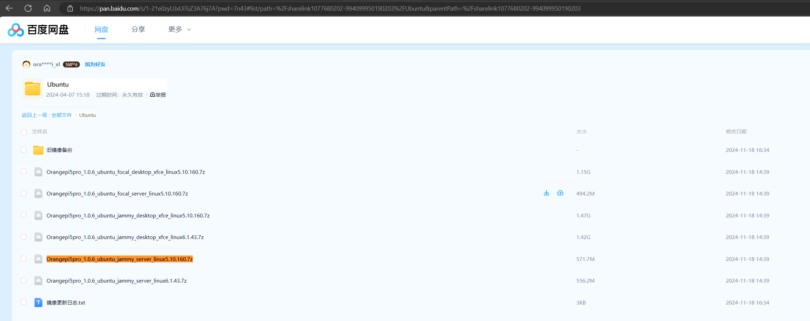
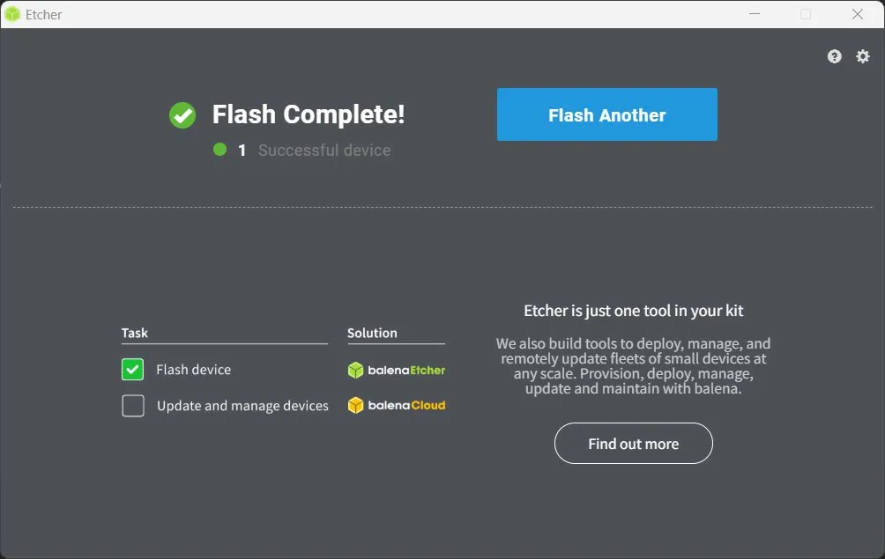

# 香橙派5Pro 从零配置

> 用途：移动垃圾桶机器人主控，运行ROS2 Humble 日期：2026-03-17

---

## 1. ⁣⁤⁣​​​​​​​​​‌‌‌‌​‌‌‍​​​​​​​​​​‌​​​‌​‍​​​​​​​​​‌‌​​​‌​‍​​​​​​​​​‌‌​​​​‌‍​​​​​​​​​‌‌​​​‌‌‍​​​​​​​​​‌‌​‌​‌‌‍​​​​​​​​​‌‌‌​‌​‌‍​​​​​​​​​‌‌‌​​​​‍​​​​​​​​​‌​‌​​​​‍​​​​​​​​​‌‌‌​​‌​‍​​​​​​​​​‌‌​​‌​‌‍​​​​​​​​​‌‌​​‌‌​‍​​​​​​​​​‌‌​‌​​‌‍​​​​​​​​​‌‌‌‌​​​‍​​​​​​​​​​‌​​​‌​‍​​​​​​​​​​‌‌‌​‌​‍​​​​​​​​​​‌​​​‌​‍​​​​​​​​​​‌‌​​​‌‍​​​​​​​​​​‌​‌‌‌​‍​​​​​​​​​​‌​​​​​‍​​​​​​​​​​‌​​​‌​‍​​​​​​​​​​‌​‌‌​​‍​​​​​​​​​​‌​​​‌​‍​​​​​​​​​‌‌​‌‌‌​‍​​​​​​​​​‌‌‌​‌​‌‍​​​​​​​​​‌‌​‌‌​‌‍​​​​​​​​​‌‌​​​‌​‍​​​​​​​​​‌‌​​‌​‌‍​​​​​​​​​‌‌‌​​‌​‍​​​​​​​​​​‌​​​‌​‍​​​​​​​​​​‌‌‌​‌​‍​​​​​​​​​​‌​​​‌​‍​​​​​​​​​​‌‌​​​‌‍​​​​​​​​​​‌​‌‌‌​‍​​​​​​​​​​‌​​​​​‍​​​​​​​​​​‌​​​‌​‍​​​​​​​​​‌‌‌‌‌​‌⁤⁣⁤⁣⁤⁣‌‌‌‌‌‌‍‌‌‍‌‌‌‍‌‌‌‍‌‌‌‌‍‌‌‌‌‌‍‌‌‌‌‌‍‌‌‌‍‌‌‍‌‌‌‌‍‌‌‌‌‍‌‌‌‌‍‌‌‌‌‍‌‌‌‌‍‌‌‍‌‌‌‌‍‌‌‍‌‌‌‍‌‍‌‌‍‌‌‌‍‌‌‍‌‌‌‌‌‍‌‌‌‌‌‍‌‌‌‌‌‍‌‌‌‍‌‌‌‌‍‌‌‌‌‍‌‌‍‌‌‌‌‍‌‌‍‌‌‌‍‌‌‌‌‍‌‍‌‌‍‌‌‌‌‌‌⁤⁣⁤烧录系统镜像

### 1.1 ⁣⁤⁣​​​​​​​​​‌‌‌‌​‌‌‍​​​​​​​​​​‌​​​‌​‍​​​​​​​​​‌‌​​​‌​‍​​​​​​​​​‌‌​​​​‌‍​​​​​​​​​‌‌​​​‌‌‍​​​​​​​​​‌‌​‌​‌‌‍​​​​​​​​​‌‌‌​‌​‌‍​​​​​​​​​‌‌‌​​​​‍​​​​​​​​​‌​‌​​​​‍​​​​​​​​​‌‌‌​​‌​‍​​​​​​​​​‌‌​​‌​‌‍​​​​​​​​​‌‌​​‌‌​‍​​​​​​​​​‌‌​‌​​‌‍​​​​​​​​​‌‌‌‌​​​‍​​​​​​​​​​‌​​​‌​‍​​​​​​​​​​‌‌‌​‌​‍​​​​​​​​​​‌​​​‌​‍​​​​​​​​​​‌‌​​​‌‍​​​​​​​​​​‌​‌‌‌​‍​​​​​​​​​​‌‌​​​‌‍​​​​​​​​​​‌​​​​​‍​​​​​​​​​​‌​​​‌​‍​​​​​​​​​​‌​‌‌​​‍​​​​​​​​​​‌​​​‌​‍​​​​​​​​​‌‌​‌‌‌​‍​​​​​​​​​‌‌‌​‌​‌‍​​​​​​​​​‌‌​‌‌​‌‍​​​​​​​​​‌‌​​​‌​‍​​​​​​​​​‌‌​​‌​‌‍​​​​​​​​​‌‌‌​​‌​‍​​​​​​​​​​‌​​​‌​‍​​​​​​​​​​‌‌‌​‌​‍​​​​​​​​​​‌​​​‌​‍​​​​​​​​​​‌‌​​​‌‍​​​​​​​​​​‌​‌‌‌​‍​​​​​​​​​​‌‌​​​‌‍​​​​​​​​​​‌​​​​​‍​​​​​​​​​​‌​​​‌​‍​​​​​​​​​‌‌‌‌‌​‌⁤⁣⁤⁣⁤⁣‌‌‌‌‌‌‍‌‌‍‌‌‌‍‌‌‌‍‌‌‌‌‍‌‌‌‌‌‍‌‌‌‌‌‍‌‌‌‍‌‌‍‌‌‌‌‍‌‌‌‌‍‌‌‌‌‍‌‌‌‌‍‌‌‌‌‍‌‌‍‌‌‌‌‍‌‌‍‌‌‌‍‌‌‌‌‍‌‌‌‍‌‍‌‌‍‌‌‌‍‌‌‍‌‌‌‌‌‍‌‌‌‌‌‍‌‌‌‌‌‍‌‌‌‍‌‌‌‌‍‌‌‌‌‍‌‌‍‌‌‌‌‍‌‌‍‌‌‌‍‌‌‌‌‍‌‌‌‍‌‍‌‌‍‌‌‌‌‌‌⁤⁣⁤镜像选择

- 官网：http://www.orangepi.org 百度网盘
- 选择：`Orangepi5pro_1.0.6_ubuntu_jammy_server_linux5.10.160.7z`​
- **选Server(非桌面版)不选Desktop(桌面版)：**  机器人不需要图形界面，省内存省资源
- 

### 1.2 ⁣⁤⁣​​​​​​​​​‌‌‌‌​‌‌‍​​​​​​​​​​‌​​​‌​‍​​​​​​​​​‌‌​​​‌​‍​​​​​​​​​‌‌​​​​‌‍​​​​​​​​​‌‌​​​‌‌‍​​​​​​​​​‌‌​‌​‌‌‍​​​​​​​​​‌‌‌​‌​‌‍​​​​​​​​​‌‌‌​​​​‍​​​​​​​​​‌​‌​​​​‍​​​​​​​​​‌‌‌​​‌​‍​​​​​​​​​‌‌​​‌​‌‍​​​​​​​​​‌‌​​‌‌​‍​​​​​​​​​‌‌​‌​​‌‍​​​​​​​​​‌‌‌‌​​​‍​​​​​​​​​​‌​​​‌​‍​​​​​​​​​​‌‌‌​‌​‍​​​​​​​​​​‌​​​‌​‍​​​​​​​​​​‌‌​​​‌‍​​​​​​​​​​‌​‌‌‌​‍​​​​​​​​​​‌‌​​‌​‍​​​​​​​​​​‌​​​​​‍​​​​​​​​​​‌​​​‌​‍​​​​​​​​​​‌​‌‌​​‍​​​​​​​​​​‌​​​‌​‍​​​​​​​​​‌‌​‌‌‌​‍​​​​​​​​​‌‌‌​‌​‌‍​​​​​​​​​‌‌​‌‌​‌‍​​​​​​​​​‌‌​​​‌​‍​​​​​​​​​‌‌​​‌​‌‍​​​​​​​​​‌‌‌​​‌​‍​​​​​​​​​​‌​​​‌​‍​​​​​​​​​​‌‌‌​‌​‍​​​​​​​​​​‌​​​‌​‍​​​​​​​​​​‌‌​​​‌‍​​​​​​​​​​‌​‌‌‌​‍​​​​​​​​​​‌‌​​‌​‍​​​​​​​​​​‌​​​​​‍​​​​​​​​​​‌​​​‌​‍​​​​​​​​​‌‌‌‌‌​‌⁤⁣⁤⁣⁤⁣‌‌‌‌‌‌‍‌‌‍‌‌‌‍‌‌‌‍‌‌‌‌‍‌‌‌‌‌‍‌‌‌‌‌‍‌‌‌‍‌‌‍‌‌‌‌‍‌‌‌‌‍‌‌‌‌‍‌‌‌‌‍‌‌‌‌‍‌‌‍‌‌‌‌‍‌‌‍‌‌‌‍‌‌‌‌‍‌‌‌‍‌‍‌‌‍‌‌‌‍‌‌‍‌‌‌‌‌‍‌‌‌‌‌‍‌‌‌‌‌‍‌‌‌‍‌‌‌‌‍‌‌‌‌‍‌‌‍‌‌‌‌‍‌‌‍‌‌‌‍‌‌‌‌‍‌‌‌‍‌‍‌‌‍‌‌‌‌‌‌⁤⁣⁤烧录工具（会自动格式化内存卡）

- **工具：**  balenaEtcher（https://etcher.balena.io/）
- **步骤：**

  1. 需要先解压`Orangepi5pro_1.0.6_ubuntu_jammy_server_linux5.10.160.7z`​
  2. Flash from file → 选择 `.img`​
  3. Select target → 选SD卡（注意确认容量）  
      ⚠️ 会完全覆盖 TF 卡原有数据
  4. Flash! → 等待 Flash Complete!
  5. 
  6. 烧录完成  
      ​

---

## 2. ⁣⁤⁣​​​​​​​​​‌‌‌‌​‌‌‍​​​​​​​​​​‌​​​‌​‍​​​​​​​​​‌‌​​​‌​‍​​​​​​​​​‌‌​​​​‌‍​​​​​​​​​‌‌​​​‌‌‍​​​​​​​​​‌‌​‌​‌‌‍​​​​​​​​​‌‌‌​‌​‌‍​​​​​​​​​‌‌‌​​​​‍​​​​​​​​​‌​‌​​​​‍​​​​​​​​​‌‌‌​​‌​‍​​​​​​​​​‌‌​​‌​‌‍​​​​​​​​​‌‌​​‌‌​‍​​​​​​​​​‌‌​‌​​‌‍​​​​​​​​​‌‌‌‌​​​‍​​​​​​​​​​‌​​​‌​‍​​​​​​​​​​‌‌‌​‌​‍​​​​​​​​​​‌​​​‌​‍​​​​​​​​​​‌‌​​‌​‍​​​​​​​​​​‌​‌‌‌​‍​​​​​​​​​​‌​​​​​‍​​​​​​​​​​‌​​​‌​‍​​​​​​​​​​‌​‌‌​​‍​​​​​​​​​​‌​​​‌​‍​​​​​​​​​‌‌​‌‌‌​‍​​​​​​​​​‌‌‌​‌​‌‍​​​​​​​​​‌‌​‌‌​‌‍​​​​​​​​​‌‌​​​‌​‍​​​​​​​​​‌‌​​‌​‌‍​​​​​​​​​‌‌‌​​‌​‍​​​​​​​​​​‌​​​‌​‍​​​​​​​​​​‌‌‌​‌​‍​​​​​​​​​​‌​​​‌​‍​​​​​​​​​​‌‌​​‌​‍​​​​​​​​​​‌​‌‌‌​‍​​​​​​​​​​‌​​​​​‍​​​​​​​​​​‌​​​‌​‍​​​​​​​​​‌‌‌‌‌​‌⁤⁣⁤⁣⁤⁣‌‌‌‌‌‌‍‌‌‍‌‌‌‍‌‌‌‍‌‌‌‌‍‌‌‌‌‌‍‌‌‌‌‌‍‌‌‌‍‌‌‍‌‌‌‌‍‌‌‌‌‍‌‌‌‌‍‌‌‌‌‍‌‌‌‌‍‌‌‍‌‌‌‌‍‌‌‍‌‌‍‌‌‌‍‌‌‍‌‌‌‌‌‍‌‌‌‌‌‍‌‌‌‌‌‍‌‌‌‍‌‌‌‌‍‌‌‌‌‍‌‌‍‌‌‌‌‍‌‌‍‌‌‌‍‌‌‌‌‍‌‍‌‌‍‌‌‌‌‌‌⁤⁣⁤二、首次启动与登录

接显示器上电，自动登录后看到：

```
Welcome to Orange Pi 1.0.6 Jammy with Linux 5.10.160-rockchip-rk3588
```

**建议立即改密码：**

```bash
passwd
sudo passwd root
```

---

## 3. ⁣⁤⁣​​​​​​​​​‌‌‌‌​‌‌‍​​​​​​​​​​‌​​​‌​‍​​​​​​​​​‌‌​​​‌​‍​​​​​​​​​‌‌​​​​‌‍​​​​​​​​​‌‌​​​‌‌‍​​​​​​​​​‌‌​‌​‌‌‍​​​​​​​​​‌‌‌​‌​‌‍​​​​​​​​​‌‌‌​​​​‍​​​​​​​​​‌​‌​​​​‍​​​​​​​​​‌‌‌​​‌​‍​​​​​​​​​‌‌​​‌​‌‍​​​​​​​​​‌‌​​‌‌​‍​​​​​​​​​‌‌​‌​​‌‍​​​​​​​​​‌‌‌‌​​​‍​​​​​​​​​​‌​​​‌​‍​​​​​​​​​​‌‌‌​‌​‍​​​​​​​​​​‌​​​‌​‍​​​​​​​​​​‌‌​​‌‌‍​​​​​​​​​​‌​‌‌‌​‍​​​​​​​​​​‌​​​​​‍​​​​​​​​​​‌​​​‌​‍​​​​​​​​​​‌​‌‌​​‍​​​​​​​​​​‌​​​‌​‍​​​​​​​​​‌‌​‌‌‌​‍​​​​​​​​​‌‌‌​‌​‌‍​​​​​​​​​‌‌​‌‌​‌‍​​​​​​​​​‌‌​​​‌​‍​​​​​​​​​‌‌​​‌​‌‍​​​​​​​​​‌‌‌​​‌​‍​​​​​​​​​​‌​​​‌​‍​​​​​​​​​​‌‌‌​‌​‍​​​​​​​​​​‌​​​‌​‍​​​​​​​​​​‌‌​​‌‌‍​​​​​​​​​​‌​‌‌‌​‍​​​​​​​​​​‌​​​​​‍​​​​​​​​​​‌​​​‌​‍​​​​​​​​​‌‌‌‌‌​‌⁤⁣⁤⁣⁤⁣‌‌‌‌‌‌‍‌‌‍‌‌‌‍‌‌‌‍‌‌‌‌‍‌‌‌‌‌‍‌‌‌‌‌‍‌‌‌‍‌‌‍‌‌‌‌‍‌‌‌‌‍‌‌‌‌‍‌‌‌‌‍‌‌‌‌‍‌‌‍‌‌‌‌‍‌‌‍‌‌‍‌‌‌‍‌‌‍‌‌‌‌‌‍‌‌‌‌‌‍‌‌‌‌‌‍‌‌‌‍‌‌‌‌‍‌‌‌‌‍‌‌‍‌‌‌‌‍‌‌‍‌‌‌‌‍‌‌‌‌‍‌‍‌‌‍‌‌‌‌‌‌⁤⁣⁤三、连接 WiFi

```bash
# 方式一：命令行（推荐）
sudo nmcli dev wifi connect "热点名称" password "密码"

# 方式二：图形配置工具
sudo orangepi-config
# 进入 Network → WiFi
```

**确认 IP：**

```bash
ip addr show wlan0
# 记录 inet 后面的 IP，如 192.168.16.210
```

**从 Windows/WSL SSH 连接：**

```bash
ssh orangepi@192.168.16.210
```

---

## 4. ⁣⁤⁣​​​​​​​​​‌‌‌‌​‌‌‍​​​​​​​​​​‌​​​‌​‍​​​​​​​​​‌‌​​​‌​‍​​​​​​​​​‌‌​​​​‌‍​​​​​​​​​‌‌​​​‌‌‍​​​​​​​​​‌‌​‌​‌‌‍​​​​​​​​​‌‌‌​‌​‌‍​​​​​​​​​‌‌‌​​​​‍​​​​​​​​​‌​‌​​​​‍​​​​​​​​​‌‌‌​​‌​‍​​​​​​​​​‌‌​​‌​‌‍​​​​​​​​​‌‌​​‌‌​‍​​​​​​​​​‌‌​‌​​‌‍​​​​​​​​​‌‌‌‌​​​‍​​​​​​​​​​‌​​​‌​‍​​​​​​​​​​‌‌‌​‌​‍​​​​​​​​​​‌​​​‌​‍​​​​​​​​​​‌‌​‌​​‍​​​​​​​​​​‌​‌‌‌​‍​​​​​​​​​​‌​​​​​‍​​​​​​​​​​‌​​​‌​‍​​​​​​​​​​‌​‌‌​​‍​​​​​​​​​​‌​​​‌​‍​​​​​​​​​‌‌​‌‌‌​‍​​​​​​​​​‌‌‌​‌​‌‍​​​​​​​​​‌‌​‌‌​‌‍​​​​​​​​​‌‌​​​‌​‍​​​​​​​​​‌‌​​‌​‌‍​​​​​​​​​‌‌‌​​‌​‍​​​​​​​​​​‌​​​‌​‍​​​​​​​​​​‌‌‌​‌​‍​​​​​​​​​​‌​​​‌​‍​​​​​​​​​​‌‌​‌​​‍​​​​​​​​​​‌​‌‌‌​‍​​​​​​​​​​‌​​​​​‍​​​​​​​​​​‌​​​‌​‍​​​​​​​​​‌‌‌‌‌​‌⁤⁣⁤⁣⁤⁣‌‌‌‌‌‌‍‌‌‍‌‌‌‍‌‌‌‍‌‌‌‌‍‌‌‌‌‌‍‌‌‌‌‌‍‌‌‌‍‌‌‍‌‌‌‌‍‌‌‌‌‍‌‌‌‌‍‌‌‌‌‍‌‌‌‌‍‌‌‍‌‌‌‌‍‌‌‍‌‌‍‌‌‌‍‌‌‍‌‌‌‌‌‍‌‌‌‌‌‍‌‌‌‌‌‍‌‌‌‍‌‌‌‌‍‌‌‌‌‍‌‌‍‌‌‌‌‍‌‌‍‌‌‌‍‌‌‌‌‍‌‍‌‌‍‌‌‌‌‌‌⁤⁣⁤四、启用 UART1

### 4.1 ⁣⁤⁣​​​​​​​​​‌‌‌‌​‌‌‍​​​​​​​​​​‌​​​‌​‍​​​​​​​​​‌‌​​​‌​‍​​​​​​​​​‌‌​​​​‌‍​​​​​​​​​‌‌​​​‌‌‍​​​​​​​​​‌‌​‌​‌‌‍​​​​​​​​​‌‌‌​‌​‌‍​​​​​​​​​‌‌‌​​​​‍​​​​​​​​​‌​‌​​​​‍​​​​​​​​​‌‌‌​​‌​‍​​​​​​​​​‌‌​​‌​‌‍​​​​​​​​​‌‌​​‌‌​‍​​​​​​​​​‌‌​‌​​‌‍​​​​​​​​​‌‌‌‌​​​‍​​​​​​​​​​‌​​​‌​‍​​​​​​​​​​‌‌‌​‌​‍​​​​​​​​​​‌​​​‌​‍​​​​​​​​​​‌‌​‌​​‍​​​​​​​​​​‌​‌‌‌​‍​​​​​​​​​​‌‌​​​‌‍​​​​​​​​​​‌​​​​​‍​​​​​​​​​​‌​​​‌​‍​​​​​​​​​​‌​‌‌​​‍​​​​​​​​​​‌​​​‌​‍​​​​​​​​​‌‌​‌‌‌​‍​​​​​​​​​‌‌‌​‌​‌‍​​​​​​​​​‌‌​‌‌​‌‍​​​​​​​​​‌‌​​​‌​‍​​​​​​​​​‌‌​​‌​‌‍​​​​​​​​​‌‌‌​​‌​‍​​​​​​​​​​‌​​​‌​‍​​​​​​​​​​‌‌‌​‌​‍​​​​​​​​​​‌​​​‌​‍​​​​​​​​​​‌‌​‌​​‍​​​​​​​​​​‌​‌‌‌​‍​​​​​​​​​​‌‌​​​‌‍​​​​​​​​​​‌​​​​​‍​​​​​​​​​​‌​​​‌​‍​​​​​​​​​‌‌‌‌‌​‌⁤⁣⁤⁣⁤⁣‌‌‌‌‌‌‍‌‌‍‌‌‌‍‌‌‌‍‌‌‌‌‍‌‌‌‌‌‍‌‌‌‌‌‍‌‌‌‍‌‌‍‌‌‌‌‍‌‌‌‌‍‌‌‌‌‍‌‌‌‌‍‌‌‌‌‍‌‌‍‌‌‌‌‍‌‌‍‌‌‌‍‌‌‌‌‍‌‌‌‍‌‍‌‌‍‌‌‌‍‌‌‍‌‌‌‌‌‍‌‌‌‌‌‍‌‌‌‌‌‍‌‌‌‍‌‌‌‌‍‌‌‌‌‍‌‌‍‌‌‌‌‍‌‌‍‌‌‌‍‌‌‌‌‍‌‌‌‍‌‍‌‌‍‌‌‌‌‌‌⁤⁣⁤确认 UART1 的设备树地址

香橙派 5 Pro 的 UART1 寄存器地址是 `feb40000`，对应别名 `serial1`：

```bash
cat /proc/device-tree/aliases/serial1
# 输出：/serial@feb40000
```

### 4.2 ⁣⁤⁣​​​​​​​​​‌‌‌‌​‌‌‍​​​​​​​​​​‌​​​‌​‍​​​​​​​​​‌‌​​​‌​‍​​​​​​​​​‌‌​​​​‌‍​​​​​​​​​‌‌​​​‌‌‍​​​​​​​​​‌‌​‌​‌‌‍​​​​​​​​​‌‌‌​‌​‌‍​​​​​​​​​‌‌‌​​​​‍​​​​​​​​​‌​‌​​​​‍​​​​​​​​​‌‌‌​​‌​‍​​​​​​​​​‌‌​​‌​‌‍​​​​​​​​​‌‌​​‌‌​‍​​​​​​​​​‌‌​‌​​‌‍​​​​​​​​​‌‌‌‌​​​‍​​​​​​​​​​‌​​​‌​‍​​​​​​​​​​‌‌‌​‌​‍​​​​​​​​​​‌​​​‌​‍​​​​​​​​​​‌‌​‌​​‍​​​​​​​​​​‌​‌‌‌​‍​​​​​​​​​​‌‌​​‌​‍​​​​​​​​​​‌​​​​​‍​​​​​​​​​​‌​​​‌​‍​​​​​​​​​​‌​‌‌​​‍​​​​​​​​​​‌​​​‌​‍​​​​​​​​​‌‌​‌‌‌​‍​​​​​​​​​‌‌‌​‌​‌‍​​​​​​​​​‌‌​‌‌​‌‍​​​​​​​​​‌‌​​​‌​‍​​​​​​​​​‌‌​​‌​‌‍​​​​​​​​​‌‌‌​​‌​‍​​​​​​​​​​‌​​​‌​‍​​​​​​​​​​‌‌‌​‌​‍​​​​​​​​​​‌​​​‌​‍​​​​​​​​​​‌‌​‌​​‍​​​​​​​​​​‌​‌‌‌​‍​​​​​​​​​​‌‌​​‌​‍​​​​​​​​​​‌​​​​​‍​​​​​​​​​​‌​​​‌​‍​​​​​​​​​‌‌‌‌‌​‌⁤⁣⁤⁣⁤⁣‌‌‌‌‌‌‍‌‌‍‌‌‌‍‌‌‌‍‌‌‌‌‍‌‌‌‌‌‍‌‌‌‌‌‍‌‌‌‍‌‌‍‌‌‌‌‍‌‌‌‌‍‌‌‌‌‍‌‌‌‌‍‌‌‌‌‍‌‌‍‌‌‌‌‍‌‌‍‌‌‌‍‌‌‌‌‍‌‌‌‍‌‍‌‌‍‌‌‌‍‌‌‍‌‌‌‌‌‍‌‌‌‌‌‍‌‌‌‌‌‍‌‌‌‍‌‌‌‌‍‌‌‌‌‍‌‌‍‌‌‌‌‍‌‌‍‌‌‌‍‌‌‌‌‍‌‌‌‍‌‍‌‌‍‌‌‌‌‌‌⁤⁣⁤启用方法（手动写入配置文件）

```bash
# 查看当前配置
cat /boot/orangepiEnv.txt

# 添加 uart1-m1 overlay
echo "overlays=uart1-m1" | sudo tee -a /boot/orangepiEnv.txt

# 确认写入
cat /boot/orangepiEnv.txt
# 应看到：overlays=uart1-m1

# 重启
sudo reboot
```

### 4.3 ⁣⁤⁣​​​​​​​​​‌‌‌‌​‌‌‍​​​​​​​​​​‌​​​‌​‍​​​​​​​​​‌‌​​​‌​‍​​​​​​​​​‌‌​​​​‌‍​​​​​​​​​‌‌​​​‌‌‍​​​​​​​​​‌‌​‌​‌‌‍​​​​​​​​​‌‌‌​‌​‌‍​​​​​​​​​‌‌‌​​​​‍​​​​​​​​​‌​‌​​​​‍​​​​​​​​​‌‌‌​​‌​‍​​​​​​​​​‌‌​​‌​‌‍​​​​​​​​​‌‌​​‌‌​‍​​​​​​​​​‌‌​‌​​‌‍​​​​​​​​​‌‌‌‌​​​‍​​​​​​​​​​‌​​​‌​‍​​​​​​​​​​‌‌‌​‌​‍​​​​​​​​​​‌​​​‌​‍​​​​​​​​​​‌‌​‌​​‍​​​​​​​​​​‌​‌‌‌​‍​​​​​​​​​​‌‌​​‌‌‍​​​​​​​​​​‌​​​​​‍​​​​​​​​​​‌​​​‌​‍​​​​​​​​​​‌​‌‌​​‍​​​​​​​​​​‌​​​‌​‍​​​​​​​​​‌‌​‌‌‌​‍​​​​​​​​​‌‌‌​‌​‌‍​​​​​​​​​‌‌​‌‌​‌‍​​​​​​​​​‌‌​​​‌​‍​​​​​​​​​‌‌​​‌​‌‍​​​​​​​​​‌‌‌​​‌​‍​​​​​​​​​​‌​​​‌​‍​​​​​​​​​​‌‌‌​‌​‍​​​​​​​​​​‌​​​‌​‍​​​​​​​​​​‌‌​‌​​‍​​​​​​​​​​‌​‌‌‌​‍​​​​​​​​​​‌‌​​‌‌‍​​​​​​​​​​‌​​​​​‍​​​​​​​​​​‌​​​‌​‍​​​​​​​​​‌‌‌‌‌​‌⁤⁣⁤⁣⁤⁣‌‌‌‌‌‌‍‌‌‍‌‌‌‍‌‌‌‍‌‌‌‌‍‌‌‌‌‌‍‌‌‌‌‌‍‌‌‌‍‌‌‍‌‌‌‌‍‌‌‌‌‍‌‌‌‌‍‌‌‌‌‍‌‌‌‌‍‌‌‍‌‌‌‌‍‌‌‍‌‌‌‍‌‌‌‌‍‌‌‌‌‍‌‍‌‌‍‌‌‌‍‌‌‍‌‌‌‌‌‍‌‌‌‌‌‍‌‌‌‌‌‍‌‌‌‍‌‌‌‌‍‌‌‌‌‍‌‌‍‌‌‌‌‍‌‌‍‌‌‌‍‌‌‌‌‍‌‌‌‌‍‌‍‌‌‍‌‌‌‌‌‌⁤⁣⁤验证

```bash
dmesg | grep feb40000
# 期望：feb40000.serial: ttyS1 at MMIO 0xfeb40000 ...

ls /dev/ttyS*
# 期望：/dev/ttyS1  /dev/ttyS9
```

**结论：UART1**  **=**    **​`/dev/ttyS1`​**​

### 4.4 ⁣⁤⁣​​​​​​​​​‌‌‌‌​‌‌‍​​​​​​​​​​‌​​​‌​‍​​​​​​​​​‌‌​​​‌​‍​​​​​​​​​‌‌​​​​‌‍​​​​​​​​​‌‌​​​‌‌‍​​​​​​​​​‌‌​‌​‌‌‍​​​​​​​​​‌‌‌​‌​‌‍​​​​​​​​​‌‌‌​​​​‍​​​​​​​​​‌​‌​​​​‍​​​​​​​​​‌‌‌​​‌​‍​​​​​​​​​‌‌​​‌​‌‍​​​​​​​​​‌‌​​‌‌​‍​​​​​​​​​‌‌​‌​​‌‍​​​​​​​​​‌‌‌‌​​​‍​​​​​​​​​​‌​​​‌​‍​​​​​​​​​​‌‌‌​‌​‍​​​​​​​​​​‌​​​‌​‍​​​​​​​​​​‌‌​‌​​‍​​​​​​​​​​‌​‌‌‌​‍​​​​​​​​​​‌‌​‌​​‍​​​​​​​​​​‌​​​​​‍​​​​​​​​​​‌​​​‌​‍​​​​​​​​​​‌​‌‌​​‍​​​​​​​​​​‌​​​‌​‍​​​​​​​​​‌‌​‌‌‌​‍​​​​​​​​​‌‌‌​‌​‌‍​​​​​​​​​‌‌​‌‌​‌‍​​​​​​​​​‌‌​​​‌​‍​​​​​​​​​‌‌​​‌​‌‍​​​​​​​​​‌‌‌​​‌​‍​​​​​​​​​​‌​​​‌​‍​​​​​​​​​​‌‌‌​‌​‍​​​​​​​​​​‌​​​‌​‍​​​​​​​​​​‌‌​‌​​‍​​​​​​​​​​‌​‌‌‌​‍​​​​​​​​​​‌‌​‌​​‍​​​​​​​​​​‌​​​​​‍​​​​​​​​​​‌​​​‌​‍​​​​​​​​​‌‌‌‌‌​‌⁤⁣⁤⁣⁤⁣‌‌‌‌‌‌‍‌‌‍‌‌‌‍‌‌‌‍‌‌‌‌‍‌‌‌‌‌‍‌‌‌‌‌‍‌‌‌‍‌‌‍‌‌‌‌‍‌‌‌‌‍‌‌‌‌‍‌‌‌‌‍‌‌‌‌‍‌‌‍‌‌‌‌‍‌‌‍‌‌‍‌‌‌‍‌‌‍‌‌‌‌‌‍‌‌‌‌‌‍‌‌‌‌‌‍‌‌‌‍‌‌‌‌‍‌‌‌‌‍‌‌‍‌‌‌‌‍‌‌‍‌‌‌‍‌‌‌‌‍‌‌‌‍‌‍‌‌‍‌‌‌‌‌‌⁤⁣⁤⚠️ 已知问题

​`sudo orangepi-config` → System → Hardware 勾选 uart1-m1 后点 Save， 在 SSH 终端下 **Save 可能不写入** `/boot/orangepiEnv.txt`， 需要用上面的 `tee` 命令手动添加。

---

‍

## 5. ⁣⁤⁣​​​​​​​​​‌‌‌‌​‌‌‍​​​​​​​​​​‌​​​‌​‍​​​​​​​​​‌‌​​​‌​‍​​​​​​​​​‌‌​​​​‌‍​​​​​​​​​‌‌​​​‌‌‍​​​​​​​​​‌‌​‌​‌‌‍​​​​​​​​​‌‌‌​‌​‌‍​​​​​​​​​‌‌‌​​​​‍​​​​​​​​​‌​‌​​​​‍​​​​​​​​​‌‌‌​​‌​‍​​​​​​​​​‌‌​​‌​‌‍​​​​​​​​​‌‌​​‌‌​‍​​​​​​​​​‌‌​‌​​‌‍​​​​​​​​​‌‌‌‌​​​‍​​​​​​​​​​‌​​​‌​‍​​​​​​​​​​‌‌‌​‌​‍​​​​​​​​​​‌​​​‌​‍​​​​​​​​​​‌‌​‌​‌‍​​​​​​​​​​‌​‌‌‌​‍​​​​​​​​​​‌​​​​​‍​​​​​​​​​​‌​​​‌​‍​​​​​​​​​​‌​‌‌​​‍​​​​​​​​​​‌​​​‌​‍​​​​​​​​​‌‌​‌‌‌​‍​​​​​​​​​‌‌‌​‌​‌‍​​​​​​​​​‌‌​‌‌​‌‍​​​​​​​​​‌‌​​​‌​‍​​​​​​​​​‌‌​​‌​‌‍​​​​​​​​​‌‌‌​​‌​‍​​​​​​​​​​‌​​​‌​‍​​​​​​​​​​‌‌‌​‌​‍​​​​​​​​​​‌​​​‌​‍​​​​​​​​​​‌‌​‌​‌‍​​​​​​​​​​‌​‌‌‌​‍​​​​​​​​​​‌​​​​​‍​​​​​​​​​​‌​​​‌​‍​​​​​​​​​‌‌‌‌‌​‌⁤⁣⁤⁣⁤⁣‌‌‌‌‌‌‍‌‌‍‌‌‌‍‌‌‌‍‌‌‌‌‍‌‌‌‌‌‍‌‌‌‌‌‍‌‌‌‍‌‌‍‌‌‌‌‍‌‌‌‌‍‌‌‌‌‍‌‌‌‌‍‌‌‌‌‍‌‌‍‌‌‌‌‍‌‌‍‌‌‍‌‌‌‍‌‌‍‌‌‌‌‌‍‌‌‌‌‌‍‌‌‌‌‌‍‌‌‌‍‌‌‌‌‍‌‌‌‌‍‌‌‍‌‌‌‌‍‌‌‍‌‌‌‌‍‌‌‌‌‍‌‍‌‌‍‌‌‌‌‌‌⁤⁣⁤五、安装ROS2 Humble

### 5.1 ⁣⁤⁣​​​​​​​​​‌‌‌‌​‌‌‍​​​​​​​​​​‌​​​‌​‍​​​​​​​​​‌‌​​​‌​‍​​​​​​​​​‌‌​​​​‌‍​​​​​​​​​‌‌​​​‌‌‍​​​​​​​​​‌‌​‌​‌‌‍​​​​​​​​​‌‌‌​‌​‌‍​​​​​​​​​‌‌‌​​​​‍​​​​​​​​​‌​‌​​​​‍​​​​​​​​​‌‌‌​​‌​‍​​​​​​​​​‌‌​​‌​‌‍​​​​​​​​​‌‌​​‌‌​‍​​​​​​​​​‌‌​‌​​‌‍​​​​​​​​​‌‌‌‌​​​‍​​​​​​​​​​‌​​​‌​‍​​​​​​​​​​‌‌‌​‌​‍​​​​​​​​​​‌​​​‌​‍​​​​​​​​​​‌‌​‌​‌‍​​​​​​​​​​‌​‌‌‌​‍​​​​​​​​​​‌‌​​​‌‍​​​​​​​​​​‌​​​​​‍​​​​​​​​​​‌​​​‌​‍​​​​​​​​​​‌​‌‌​​‍​​​​​​​​​​‌​​​‌​‍​​​​​​​​​‌‌​‌‌‌​‍​​​​​​​​​‌‌‌​‌​‌‍​​​​​​​​​‌‌​‌‌​‌‍​​​​​​​​​‌‌​​​‌​‍​​​​​​​​​‌‌​​‌​‌‍​​​​​​​​​‌‌‌​​‌​‍​​​​​​​​​​‌​​​‌​‍​​​​​​​​​​‌‌‌​‌​‍​​​​​​​​​​‌​​​‌​‍​​​​​​​​​​‌‌​‌​‌‍​​​​​​​​​​‌​‌‌‌​‍​​​​​​​​​​‌‌​​​‌‍​​​​​​​​​​‌​​​​​‍​​​​​​​​​​‌​​​‌​‍​​​​​​​​​‌‌‌‌‌​‌⁤⁣⁤⁣⁤⁣‌‌‌‌‌‌‍‌‌‍‌‌‌‍‌‌‌‍‌‌‌‌‍‌‌‌‌‌‍‌‌‌‌‌‍‌‌‌‍‌‌‍‌‌‌‌‍‌‌‌‌‍‌‌‌‌‍‌‌‌‌‍‌‌‌‌‍‌‌‍‌‌‌‌‍‌‌‍‌‌‌‌‍‌‌‌‌‍‌‌‌‍‌‍‌‌‍‌‌‌‍‌‌‍‌‌‌‌‌‍‌‌‌‌‌‍‌‌‌‌‌‍‌‌‌‍‌‌‌‌‍‌‌‌‌‍‌‌‍‌‌‌‌‍‌‌‍‌‌‌‌‍‌‌‌‌‍‌‌‌‍‌‍‌‌‍‌‌‌‌‌‌⁤⁣⁤鱼香ROS一键安装

```bash
wget http://fishros.com/install -O fishros && bash fishros
```

选择：`一键安装ROS2 Humble`​

安装过程中询问重启服务时，直接选 `Ok`。  
​​

### 5.2 ⁣⁤⁣​​​​​​​​​‌‌‌‌​‌‌‍​​​​​​​​​​‌​​​‌​‍​​​​​​​​​‌‌​​​‌​‍​​​​​​​​​‌‌​​​​‌‍​​​​​​​​​‌‌​​​‌‌‍​​​​​​​​​‌‌​‌​‌‌‍​​​​​​​​​‌‌‌​‌​‌‍​​​​​​​​​‌‌‌​​​​‍​​​​​​​​​‌​‌​​​​‍​​​​​​​​​‌‌‌​​‌​‍​​​​​​​​​‌‌​​‌​‌‍​​​​​​​​​‌‌​​‌‌​‍​​​​​​​​​‌‌​‌​​‌‍​​​​​​​​​‌‌‌‌​​​‍​​​​​​​​​​‌​​​‌​‍​​​​​​​​​​‌‌‌​‌​‍​​​​​​​​​​‌​​​‌​‍​​​​​​​​​​‌‌​‌​‌‍​​​​​​​​​​‌​‌‌‌​‍​​​​​​​​​​‌‌​​‌​‍​​​​​​​​​​‌​​​​​‍​​​​​​​​​​‌​​​‌​‍​​​​​​​​​​‌​‌‌​​‍​​​​​​​​​​‌​​​‌​‍​​​​​​​​​‌‌​‌‌‌​‍​​​​​​​​​‌‌‌​‌​‌‍​​​​​​​​​‌‌​‌‌​‌‍​​​​​​​​​‌‌​​​‌​‍​​​​​​​​​‌‌​​‌​‌‍​​​​​​​​​‌‌‌​​‌​‍​​​​​​​​​​‌​​​‌​‍​​​​​​​​​​‌‌‌​‌​‍​​​​​​​​​​‌​​​‌​‍​​​​​​​​​​‌‌​‌​‌‍​​​​​​​​​​‌​‌‌‌​‍​​​​​​​​​​‌‌​​‌​‍​​​​​​​​​​‌​​​​​‍​​​​​​​​​​‌​​​‌​‍​​​​​​​​​‌‌‌‌‌​‌⁤⁣⁤⁣⁤⁣‌‌‌‌‌‌‍‌‌‍‌‌‌‍‌‌‌‍‌‌‌‌‍‌‌‌‌‌‍‌‌‌‌‌‍‌‌‌‍‌‌‍‌‌‌‌‍‌‌‌‌‍‌‌‌‌‍‌‌‌‌‍‌‌‌‌‍‌‌‍‌‌‌‌‍‌‌‍‌‌‌‌‍‌‌‌‌‍‌‌‌‍‌‍‌‌‍‌‌‌‍‌‌‍‌‌‌‌‌‍‌‌‌‌‌‍‌‌‌‌‌‍‌‌‌‍‌‌‌‌‍‌‌‌‌‍‌‌‍‌‌‌‌‍‌‌‍‌‌‌‌‍‌‌‌‌‍‌‌‌‍‌‍‌‌‍‌‌‌‌‌‌⁤⁣⁤验证安装

```bash
printenv ROS_DISTRO
humble
```

### 5.3 ⁣⁤⁣​​​​​​​​​‌‌‌‌​‌‌‍​​​​​​​​​​‌​​​‌​‍​​​​​​​​​‌‌​​​‌​‍​​​​​​​​​‌‌​​​​‌‍​​​​​​​​​‌‌​​​‌‌‍​​​​​​​​​‌‌​‌​‌‌‍​​​​​​​​​‌‌‌​‌​‌‍​​​​​​​​​‌‌‌​​​​‍​​​​​​​​​‌​‌​​​​‍​​​​​​​​​‌‌‌​​‌​‍​​​​​​​​​‌‌​​‌​‌‍​​​​​​​​​‌‌​​‌‌​‍​​​​​​​​​‌‌​‌​​‌‍​​​​​​​​​‌‌‌‌​​​‍​​​​​​​​​​‌​​​‌​‍​​​​​​​​​​‌‌‌​‌​‍​​​​​​​​​​‌​​​‌​‍​​​​​​​​​​‌‌​‌​‌‍​​​​​​​​​​‌​‌‌‌​‍​​​​​​​​​​‌‌​​‌‌‍​​​​​​​​​​‌​​​​​‍​​​​​​​​​​‌​​​‌​‍​​​​​​​​​​‌​‌‌​​‍​​​​​​​​​​‌​​​‌​‍​​​​​​​​​‌‌​‌‌‌​‍​​​​​​​​​‌‌‌​‌​‌‍​​​​​​​​​‌‌​‌‌​‌‍​​​​​​​​​‌‌​​​‌​‍​​​​​​​​​‌‌​​‌​‌‍​​​​​​​​​‌‌‌​​‌​‍​​​​​​​​​​‌​​​‌​‍​​​​​​​​​​‌‌‌​‌​‍​​​​​​​​​​‌​​​‌​‍​​​​​​​​​​‌‌​‌​‌‍​​​​​​​​​​‌​‌‌‌​‍​​​​​​​​​​‌‌​​‌‌‍​​​​​​​​​​‌​​​​​‍​​​​​​​​​​‌​​​‌​‍​​​​​​​​​‌‌‌‌‌​‌⁤⁣⁤⁣⁤⁣‌‌‌‌‌‌‍‌‌‍‌‌‌‍‌‌‌‍‌‌‌‌‍‌‌‌‌‌‍‌‌‌‌‌‍‌‌‌‍‌‌‍‌‌‌‌‍‌‌‌‌‍‌‌‌‌‍‌‌‌‌‍‌‌‌‌‍‌‌‍‌‌‌‌‍‌‌‍‌‌‌‌‍‌‌‌‌‍‌‌‌‌‍‌‍‌‌‍‌‌‌‍‌‌‍‌‌‌‌‌‍‌‌‌‌‌‍‌‌‌‌‌‍‌‌‌‍‌‌‌‌‍‌‌‌‌‍‌‌‍‌‌‌‌‍‌‌‍‌‌‌‌‍‌‌‌‌‍‌‌‌‌‍‌‍‌‌‍‌‌‌‌‌‌⁤⁣⁤配置环境变量

```bash
echo "source /opt/ros/humble/setup.bash" >> ~/.bashrc
source ~/.bashrc
```

---

## 6. ⁣⁤⁣​​​​​​​​​‌‌‌‌​‌‌‍​​​​​​​​​​‌​​​‌​‍​​​​​​​​​‌‌​​​‌​‍​​​​​​​​​‌‌​​​​‌‍​​​​​​​​​‌‌​​​‌‌‍​​​​​​​​​‌‌​‌​‌‌‍​​​​​​​​​‌‌‌​‌​‌‍​​​​​​​​​‌‌‌​​​​‍​​​​​​​​​‌​‌​​​​‍​​​​​​​​​‌‌‌​​‌​‍​​​​​​​​​‌‌​​‌​‌‍​​​​​​​​​‌‌​​‌‌​‍​​​​​​​​​‌‌​‌​​‌‍​​​​​​​​​‌‌‌‌​​​‍​​​​​​​​​​‌​​​‌​‍​​​​​​​​​​‌‌‌​‌​‍​​​​​​​​​​‌​​​‌​‍​​​​​​​​​​‌‌​‌‌​‍​​​​​​​​​​‌​‌‌‌​‍​​​​​​​​​​‌​​​​​‍​​​​​​​​​​‌​​​‌​‍​​​​​​​​​​‌​‌‌​​‍​​​​​​​​​​‌​​​‌​‍​​​​​​​​​‌‌​‌‌‌​‍​​​​​​​​​‌‌‌​‌​‌‍​​​​​​​​​‌‌​‌‌​‌‍​​​​​​​​​‌‌​​​‌​‍​​​​​​​​​‌‌​​‌​‌‍​​​​​​​​​‌‌‌​​‌​‍​​​​​​​​​​‌​​​‌​‍​​​​​​​​​​‌‌‌​‌​‍​​​​​​​​​​‌​​​‌​‍​​​​​​​​​​‌‌​‌‌​‍​​​​​​​​​​‌​‌‌‌​‍​​​​​​​​​​‌​​​​​‍​​​​​​​​​​‌​​​‌​‍​​​​​​​​​‌‌‌‌‌​‌⁤⁣⁤⁣⁤⁣‌‌‌‌‌‌‍‌‌‍‌‌‌‍‌‌‌‍‌‌‌‌‍‌‌‌‌‌‍‌‌‌‌‌‍‌‌‌‍‌‌‍‌‌‌‌‍‌‌‌‌‍‌‌‌‌‍‌‌‌‌‍‌‌‌‌‍‌‌‍‌‌‌‌‍‌‌‍‌‌‍‌‌‌‍‌‌‍‌‌‌‌‌‍‌‌‌‌‌‍‌‌‌‌‌‍‌‌‌‍‌‌‌‌‍‌‌‌‌‍‌‌‍‌‌‌‌‍‌‌‍‌‌‌‌‍‌‌‌‌‍‌‍‌‌‍‌‌‌‌‌‌⁤⁣⁤六、安装项目依赖包

```bash
sudo apt install -y \
  ros-humble-nav2-bringup \
  ros-humble-slam-toolbox \
  ros-humble-ros2-control \
  ros-humble-ros2-controllers \
  ros-humble-diff-drive-controller \
  ros-humble-rosbridge-server \
  ros-humble-navigation2 \
  python3-colcon-common-extensions \
  git
```

‍

如提示：**E:**  dpkg was interrupted, you must manually run 'sudo dpkg --configure -a' to correct the problem.

输入`sudo dpkg --configure -a` 后重新执行

---

## 7. ⁣⁤⁣​​​​​​​​​‌‌‌‌​‌‌‍​​​​​​​​​​‌​​​‌​‍​​​​​​​​​‌‌​​​‌​‍​​​​​​​​​‌‌​​​​‌‍​​​​​​​​​‌‌​​​‌‌‍​​​​​​​​​‌‌​‌​‌‌‍​​​​​​​​​‌‌‌​‌​‌‍​​​​​​​​​‌‌‌​​​​‍​​​​​​​​​‌​‌​​​​‍​​​​​​​​​‌‌‌​​‌​‍​​​​​​​​​‌‌​​‌​‌‍​​​​​​​​​‌‌​​‌‌​‍​​​​​​​​​‌‌​‌​​‌‍​​​​​​​​​‌‌‌‌​​​‍​​​​​​​​​​‌​​​‌​‍​​​​​​​​​​‌‌‌​‌​‍​​​​​​​​​​‌​​​‌​‍​​​​​​​​​​‌‌​‌‌‌‍​​​​​​​​​​‌​‌‌‌​‍​​​​​​​​​​‌​​​​​‍​​​​​​​​​​‌​​​‌​‍​​​​​​​​​​‌​‌‌​​‍​​​​​​​​​​‌​​​‌​‍​​​​​​​​​‌‌​‌‌‌​‍​​​​​​​​​‌‌‌​‌​‌‍​​​​​​​​​‌‌​‌‌​‌‍​​​​​​​​​‌‌​​​‌​‍​​​​​​​​​‌‌​​‌​‌‍​​​​​​​​​‌‌‌​​‌​‍​​​​​​​​​​‌​​​‌​‍​​​​​​​​​​‌‌‌​‌​‍​​​​​​​​​​‌​​​‌​‍​​​​​​​​​​‌‌​‌‌‌‍​​​​​​​​​​‌​‌‌‌​‍​​​​​​​​​​‌​​​​​‍​​​​​​​​​​‌​​​‌​‍​​​​​​​​​‌‌‌‌‌​‌⁤⁣⁤⁣⁤⁣‌‌‌‌‌‌‍‌‌‍‌‌‌‍‌‌‌‍‌‌‌‌‍‌‌‌‌‌‍‌‌‌‌‌‍‌‌‌‍‌‌‍‌‌‌‌‍‌‌‌‌‍‌‌‌‌‍‌‌‌‌‍‌‌‌‌‍‌‌‍‌‌‌‌‍‌‌‍‌‌‍‌‌‌‍‌‌‍‌‌‌‌‌‍‌‌‌‌‌‍‌‌‌‌‌‍‌‌‌‍‌‌‌‌‍‌‌‌‌‍‌‌‍‌‌‌‌‍‌‌‍‌‌‌‌‌‍‌‌‌‌‍‌‍‌‌‍‌‌‌‌‌‌⁤⁣⁤七、克隆项目代码

### 7.1 ⁣⁤⁣​​​​​​​​​‌‌‌‌​‌‌‍​​​​​​​​​​‌​​​‌​‍​​​​​​​​​‌‌​​​‌​‍​​​​​​​​​‌‌​​​​‌‍​​​​​​​​​‌‌​​​‌‌‍​​​​​​​​​‌‌​‌​‌‌‍​​​​​​​​​‌‌‌​‌​‌‍​​​​​​​​​‌‌‌​​​​‍​​​​​​​​​‌​‌​​​​‍​​​​​​​​​‌‌‌​​‌​‍​​​​​​​​​‌‌​​‌​‌‍​​​​​​​​​‌‌​​‌‌​‍​​​​​​​​​‌‌​‌​​‌‍​​​​​​​​​‌‌‌‌​​​‍​​​​​​​​​​‌​​​‌​‍​​​​​​​​​​‌‌‌​‌​‍​​​​​​​​​​‌​​​‌​‍​​​​​​​​​​‌‌​‌‌‌‍​​​​​​​​​​‌​‌‌‌​‍​​​​​​​​​​‌‌​​​‌‍​​​​​​​​​​‌​​​​​‍​​​​​​​​​​‌​​​‌​‍​​​​​​​​​​‌​‌‌​​‍​​​​​​​​​​‌​​​‌​‍​​​​​​​​​‌‌​‌‌‌​‍​​​​​​​​​‌‌‌​‌​‌‍​​​​​​​​​‌‌​‌‌​‌‍​​​​​​​​​‌‌​​​‌​‍​​​​​​​​​‌‌​​‌​‌‍​​​​​​​​​‌‌‌​​‌​‍​​​​​​​​​​‌​​​‌​‍​​​​​​​​​​‌‌‌​‌​‍​​​​​​​​​​‌​​​‌​‍​​​​​​​​​​‌‌​‌‌‌‍​​​​​​​​​​‌​‌‌‌​‍​​​​​​​​​​‌‌​​​‌‍​​​​​​​​​​‌​​​​​‍​​​​​​​​​​‌​​​‌​‍​​​​​​​​​‌‌‌‌‌​‌⁤⁣⁤⁣⁤⁣‌‌‌‌‌‌‍‌‌‍‌‌‌‍‌‌‌‍‌‌‌‌‍‌‌‌‌‌‍‌‌‌‌‌‍‌‌‌‍‌‌‍‌‌‌‌‍‌‌‌‌‍‌‌‌‌‍‌‌‌‌‍‌‌‌‌‍‌‌‍‌‌‌‌‍‌‌‍‌‌‌‌‌‍‌‌‌‌‍‌‌‌‍‌‍‌‌‍‌‌‌‍‌‌‍‌‌‌‌‌‍‌‌‌‌‌‍‌‌‌‌‌‍‌‌‌‍‌‌‌‌‍‌‌‌‌‍‌‌‍‌‌‌‌‍‌‌‍‌‌‌‌‌‍‌‌‌‌‍‌‌‌‍‌‍‌‌‍‌‌‌‌‌‌⁤⁣⁤配置 Git 和 SSH 密钥

```html
# 配置身份
git config --global user.email "K13640213395@outlook.com"
git config --global user.name "R136"

# 生成 SSH 密钥
ssh-keygen -t ed25519 -C "K13640213395@outlook.com"
# 一路回车

# 查看公钥
cat ~/.ssh/id_ed25519.pub
# 复制输出内容

# 添加到 GitHub：Settings → SSH and GPG keys → New SSH key

# 验证
ssh -T git@github.com
# 期望：Hi xxx! You've successfully authenticated
```

‍

### 7.2 ⁣⁤⁣​​​​​​​​​‌‌‌‌​‌‌‍​​​​​​​​​​‌​​​‌​‍​​​​​​​​​‌‌​​​‌​‍​​​​​​​​​‌‌​​​​‌‍​​​​​​​​​‌‌​​​‌‌‍​​​​​​​​​‌‌​‌​‌‌‍​​​​​​​​​‌‌‌​‌​‌‍​​​​​​​​​‌‌‌​​​​‍​​​​​​​​​‌​‌​​​​‍​​​​​​​​​‌‌‌​​‌​‍​​​​​​​​​‌‌​​‌​‌‍​​​​​​​​​‌‌​​‌‌​‍​​​​​​​​​‌‌​‌​​‌‍​​​​​​​​​‌‌‌‌​​​‍​​​​​​​​​​‌​​​‌​‍​​​​​​​​​​‌‌‌​‌​‍​​​​​​​​​​‌​​​‌​‍​​​​​​​​​​‌‌​‌‌‌‍​​​​​​​​​​‌​‌‌‌​‍​​​​​​​​​​‌‌​​‌​‍​​​​​​​​​​‌​​​​​‍​​​​​​​​​​‌​​​‌​‍​​​​​​​​​​‌​‌‌​​‍​​​​​​​​​​‌​​​‌​‍​​​​​​​​​‌‌​‌‌‌​‍​​​​​​​​​‌‌‌​‌​‌‍​​​​​​​​​‌‌​‌‌​‌‍​​​​​​​​​‌‌​​​‌​‍​​​​​​​​​‌‌​​‌​‌‍​​​​​​​​​‌‌‌​​‌​‍​​​​​​​​​​‌​​​‌​‍​​​​​​​​​​‌‌‌​‌​‍​​​​​​​​​​‌​​​‌​‍​​​​​​​​​​‌‌​‌‌‌‍​​​​​​​​​​‌​‌‌‌​‍​​​​​​​​​​‌‌​​‌​‍​​​​​​​​​​‌​​​​​‍​​​​​​​​​​‌​​​‌​‍​​​​​​​​​‌‌‌‌‌​‌⁤⁣⁤⁣⁤⁣‌‌‌‌‌‌‍‌‌‍‌‌‌‍‌‌‌‍‌‌‌‌‍‌‌‌‌‌‍‌‌‌‌‌‍‌‌‌‍‌‌‍‌‌‌‌‍‌‌‌‌‍‌‌‌‌‍‌‌‌‌‍‌‌‌‌‍‌‌‍‌‌‌‌‍‌‌‍‌‌‌‌‌‍‌‌‌‌‍‌‌‌‍‌‍‌‌‍‌‌‌‍‌‌‍‌‌‌‌‌‍‌‌‌‌‌‍‌‌‌‌‌‍‌‌‌‍‌‌‌‌‍‌‌‌‌‍‌‌‍‌‌‌‌‍‌‌‍‌‌‌‌‌‍‌‌‌‌‍‌‌‌‍‌‍‌‌‍‌‌‌‌‌‌⁤⁣⁤克隆工作区

```bash
mkdir -p ~/dev_ws
cd ~/dev_ws
git clone git@github.com:136R/dev_ws.git .
# 注意最后有个点，克隆到当前目录
```

**工作区结构：**

```
~/dev_ws/
├── CLAUDE.md        ← Claude Code 上下文
├── MEMORY.md        ← Claude Code 项目记忆
├── WORKFLOW.md      ← 用户操作手册
├── .gitignore
├── docs/vendor/     ← STM32 厂商代码
└── src/
    ├── my_bot/      ← 仿真包（禁止修改）
    └── my_bot_hw/   ← 硬件接口包
```

**安装依赖并编译：**

```bash
cd ~/dev_ws
source /opt/ros/humble/setup.bash
rosdep install --from-paths src --ignore-src -r -y
colcon build --symlink-install
```

---

## 8. ⁣⁤⁣​​​​​​​​​‌‌‌‌​‌‌‍​​​​​​​​​​‌​​​‌​‍​​​​​​​​​‌‌​​​‌​‍​​​​​​​​​‌‌​​​​‌‍​​​​​​​​​‌‌​​​‌‌‍​​​​​​​​​‌‌​‌​‌‌‍​​​​​​​​​‌‌‌​‌​‌‍​​​​​​​​​‌‌‌​​​​‍​​​​​​​​​‌​‌​​​​‍​​​​​​​​​‌‌‌​​‌​‍​​​​​​​​​‌‌​​‌​‌‍​​​​​​​​​‌‌​​‌‌​‍​​​​​​​​​‌‌​‌​​‌‍​​​​​​​​​‌‌‌‌​​​‍​​​​​​​​​​‌​​​‌​‍​​​​​​​​​​‌‌‌​‌​‍​​​​​​​​​​‌​​​‌​‍​​​​​​​​​​‌‌‌​​​‍​​​​​​​​​​‌​‌‌‌​‍​​​​​​​​​​‌​​​​​‍​​​​​​​​​​‌​​​‌​‍​​​​​​​​​​‌​‌‌​​‍​​​​​​​​​​‌​​​‌​‍​​​​​​​​​‌‌​‌‌‌​‍​​​​​​​​​‌‌‌​‌​‌‍​​​​​​​​​‌‌​‌‌​‌‍​​​​​​​​​‌‌​​​‌​‍​​​​​​​​​‌‌​​‌​‌‍​​​​​​​​​‌‌‌​​‌​‍​​​​​​​​​​‌​​​‌​‍​​​​​​​​​​‌‌‌​‌​‍​​​​​​​​​​‌​​​‌​‍​​​​​​​​​​‌‌‌​​​‍​​​​​​​​​​‌​‌‌‌​‍​​​​​​​​​​‌​​​​​‍​​​​​​​​​​‌​​​‌​‍​​​​​​​​​‌‌‌‌‌​‌⁤⁣⁤⁣⁤⁣‌‌‌‌‌‌‍‌‌‍‌‌‌‍‌‌‌‍‌‌‌‌‍‌‌‌‌‌‍‌‌‌‌‌‍‌‌‌‍‌‌‍‌‌‌‌‍‌‌‌‌‍‌‌‌‌‍‌‌‌‌‍‌‌‌‌‍‌‌‍‌‌‌‌‍‌‌‍‌‌‍‌‌‌‍‌‌‍‌‌‌‌‌‍‌‌‌‌‌‍‌‌‌‌‌‍‌‌‌‍‌‌‌‌‍‌‌‌‌‍‌‌‍‌‌‌‌‍‌‌‍‌‌‌‍‌‌‌‌‍‌‍‌‌‍‌‌‌‌‌‌⁤⁣⁤八、关键参数汇总

|参数|值|
| --------------------| --------------------------------|
|系统|Ubuntu 22.04 Jammy Server|
|内核|Linux 5.10.160-rockchip-rk3588|
|用户名|orangepi|
|WiFi IP|192.168.16.210（手机热点）|
|WiFi MAC|54:78:c9:d7:0d:58（固定）|
|UART1 设备节点|/dev/ttyS1|
|UART1 寄存器地址|feb40000|
|UART1 overlay 名称|uart1-m1|
|overlay 配置文件|/boot/orangepiEnv.txt|

## 9. ⁣⁤⁣​​​​​​​​​‌‌‌‌​‌‌‍​​​​​​​​​​‌​​​‌​‍​​​​​​​​​‌‌​​​‌​‍​​​​​​​​​‌‌​​​​‌‍​​​​​​​​​‌‌​​​‌‌‍​​​​​​​​​‌‌​‌​‌‌‍​​​​​​​​​‌‌‌​‌​‌‍​​​​​​​​​‌‌‌​​​​‍​​​​​​​​​‌​‌​​​​‍​​​​​​​​​‌‌‌​​‌​‍​​​​​​​​​‌‌​​‌​‌‍​​​​​​​​​‌‌​​‌‌​‍​​​​​​​​​‌‌​‌​​‌‍​​​​​​​​​‌‌‌‌​​​‍​​​​​​​​​​‌​​​‌​‍​​​​​​​​​​‌‌‌​‌​‍​​​​​​​​​​‌​​​‌​‍​​​​​​​​​​‌‌‌​​‌‍​​​​​​​​​​‌​‌‌‌​‍​​​​​​​​​​‌​​​​​‍​​​​​​​​​​‌​​​‌​‍​​​​​​​​​​‌​‌‌​​‍​​​​​​​​​​‌​​​‌​‍​​​​​​​​​‌‌​‌‌‌​‍​​​​​​​​​‌‌‌​‌​‌‍​​​​​​​​​‌‌​‌‌​‌‍​​​​​​​​​‌‌​​​‌​‍​​​​​​​​​‌‌​​‌​‌‍​​​​​​​​​‌‌‌​​‌​‍​​​​​​​​​​‌​​​‌​‍​​​​​​​​​​‌‌‌​‌​‍​​​​​​​​​​‌​​​‌​‍​​​​​​​​​​‌‌‌​​‌‍​​​​​​​​​​‌​‌‌‌​‍​​​​​​​​​​‌​​​​​‍​​​​​​​​​​‌​​​‌​‍​​​​​​​​​‌‌‌‌‌​‌⁤⁣⁤⁣⁤⁣‌‌‌‌‌‌‍‌‌‍‌‌‌‍‌‌‌‍‌‌‌‌‍‌‌‌‌‌‍‌‌‌‌‌‍‌‌‌‍‌‌‍‌‌‌‌‍‌‌‌‌‍‌‌‌‌‍‌‌‌‌‍‌‌‌‌‍‌‌‍‌‌‌‌‍‌‌‍‌‌‍‌‌‌‍‌‌‍‌‌‌‌‌‍‌‌‌‌‌‍‌‌‌‌‌‍‌‌‌‍‌‌‌‌‍‌‌‌‌‍‌‌‍‌‌‌‌‍‌‌‍‌‌‌‌‍‌‌‌‌‍‌‍‌‌‍‌‌‌‌‌‌⁤⁣⁤九、常用命令

```bash
# 查网络状态
ip addr show wlan0

# 查串口设备
ls /dev/ttyS* /dev/ttyAMA*

# 重新应用网络配置
sudo netplan apply

# 查ROS2环境
ros2 --version
printenv | grep ROS
```

---

## 10. ⁣⁤⁣​​​​​​​​​‌‌‌‌​‌‌‍​​​​​​​​​​‌​​​‌​‍​​​​​​​​​‌‌​​​‌​‍​​​​​​​​​‌‌​​​​‌‍​​​​​​​​​‌‌​​​‌‌‍​​​​​​​​​‌‌​‌​‌‌‍​​​​​​​​​‌‌‌​‌​‌‍​​​​​​​​​‌‌‌​​​​‍​​​​​​​​​‌​‌​​​​‍​​​​​​​​​‌‌‌​​‌​‍​​​​​​​​​‌‌​​‌​‌‍​​​​​​​​​‌‌​​‌‌​‍​​​​​​​​​‌‌​‌​​‌‍​​​​​​​​​‌‌‌‌​​​‍​​​​​​​​​​‌​​​‌​‍​​​​​​​​​​‌‌‌​‌​‍​​​​​​​​​​‌​​​‌​‍​​​​​​​​​​‌‌​​​‌‍​​​​​​​​​​‌‌​​​​‍​​​​​​​​​​‌​‌‌‌​‍​​​​​​​​​​‌​​​​​‍​​​​​​​​​​‌​​​‌​‍​​​​​​​​​​‌​‌‌​​‍​​​​​​​​​​‌​​​‌​‍​​​​​​​​​‌‌​‌‌‌​‍​​​​​​​​​‌‌‌​‌​‌‍​​​​​​​​​‌‌​‌‌​‌‍​​​​​​​​​‌‌​​​‌​‍​​​​​​​​​‌‌​​‌​‌‍​​​​​​​​​‌‌‌​​‌​‍​​​​​​​​​​‌​​​‌​‍​​​​​​​​​​‌‌‌​‌​‍​​​​​​​​​​‌​​​‌​‍​​​​​​​​​​‌‌​​​‌‍​​​​​​​​​​‌‌​​​​‍​​​​​​​​​​‌​‌‌‌​‍​​​​​​​​​​‌​​​​​‍​​​​​​​​​​‌​​​‌​‍​​​​​​​​​‌‌‌‌‌​‌⁤⁣⁤⁣⁤⁣‌‌‌‌‌‌‍‌‌‍‌‌‌‍‌‌‌‍‌‌‌‌‍‌‌‌‌‌‍‌‌‌‌‌‍‌‌‌‍‌‌‍‌‌‌‌‍‌‌‌‌‍‌‌‌‌‍‌‌‌‌‍‌‌‌‌‍‌‌‍‌‌‌‌‍‌‌‍‌‌‍‌‌‌‍‌‌‍‌‌‌‌‌‍‌‌‌‌‌‍‌‌‌‌‌‍‌‌‌‍‌‌‌‌‍‌‌‌‌‍‌‌‍‌‌‌‌‍‌‌‍‌‌‌‍‌‌‍‌‌‌‌‍‌‍‌‌‍‌‌‌‌‌‌⁤⁣⁤代理

```html
# 换用国内代理镜像
curl -Lo sing-box.tar.gz \
  https://ghfast.top/https://github.com/SagerNet/sing-box/releases/download/v1.10.7/sing-box-1.10.7-linux-arm64.tar.gz

tar -xzf sing-box.tar.gz

# 只把二进制复制到系统路径
sudo cp sing-box-1.10.7-linux-arm64/sing-box /usr/local/bin/
sudo chmod +x /usr/local/bin/sing-box

# 清理临时文件
rm -rf ~/sing-box.tar.gz ~/sing-box-1.10.7-linux-arm64/

# 验证
sing-box version

sudo mkdir -p /etc/sing-box
sudo nano /etc/sing-box/config.json
```

‍

**config.json：**

```html
{
  "inbounds": [
    {
      "type": "http",
      "listen": "127.0.0.1",
      "listen_port": 7890
    }
  ],
  "outbounds": [
    {
      "type": "vless",
      "server": "103.79.76.60",
      "server_port": 443,
      "uuid": "342b3bab-65c1-4413-9b80-2eed47ba67a7",
      "flow": "xtls-rprx-vision",
      "tls": {
        "enabled": true,
        "server_name": "addons.mozilla.org",
        "utls": {
          "enabled": true,
          "fingerprint": "chrome"
        },
        "reality": {
          "enabled": true,
          "public_key": "SDHIFX7irOg5ORccs-WSB2MQ7iY2FokATSticROW4S4",
          "short_id": "6ba85179e30d4fc2"
        }
      }
    }
  ]
}

```

‍

创建 systemd 服务：

```bash
sudo nano /etc/systemd/system/sing-box.service
```

粘贴以下内容：

```ini
[Unit]
Description=sing-box service
After=network.target

[Service]
ExecStart=/usr/local/bin/sing-box run -c /etc/sing-box/config.json
Restart=on-failure

[Install]
WantedBy=multi-user.target
```

Ctrl+O 保存，Ctrl+X 退出，然后执行：

```bash
sudo systemctl daemon-reload
sudo systemctl start sing-box
sudo systemctl enable sing-box

# 检查运行状态
sudo systemctl status sing-box
```

把 status 的输出发给我看一下。

```html
ubuntu@ubuntu:~$ sudo systemctl status sing-box
● sing-box.service - sing-box service
     Loaded: loaded (/etc/systemd/system/sing-box.service; enabled; vendor preset: enabled)
     Active: active (running) since Thu 2026-03-19 14:57:27 UTC; 6s ago
   Main PID: 27987 (sing-box)
      Tasks: 13 (limit: 9469)
     Memory: 3.6M
        CPU: 42ms
     CGroup: /system.slice/sing-box.service
             └─27987 /usr/local/bin/sing-box run -c /etc/sing-box/config.json
Mar 19 14:57:27 ubuntu systemd[1]: Started sing-box service.
Mar 19 14:57:27 ubuntu sing-box[27987]: INFO[0000] router: updated default interface wlan0, index 3
Mar 19 14:57:27 ubuntu sing-box[27987]: INFO[0000] inbound/http[0]: tcp server started at 127.0.0.1:7890
Mar 19 14:57:27 ubuntu sing-box[27987]: INFO[0000] sing-box started (0.00s)
ubuntu@ubuntu:~$
```

‍

code \~/.bashrc 添加

```html
alias proxy-on='sudo systemctl start sing-box && export http_proxy=http://127.0.0.1:7890 && export https_proxy=http://127.0.0.1:7890 && echo "代理已开启"'
alias proxy-off='sudo systemctl stop sing-box && unset http_proxy && unset https_proxy && echo "代理已关闭"'
```

proxy-on 开启代理

proxy-off 关闭代理

---

## 14. ⁣⁤⁣‌‌‌‌‌‌‍‌‌‍‌‌‌‍‌‌‌‍‌‌‌‌‍‌‌‌‌‌‍‌‌‌‌‌‍‌‌‌‍‌‌‍‌‌‌‌‍‌‌‌‌‍‌‌‌‌‍‌‌‌‌‍‌‌‌‌‍‌‌‍‌‌‌‌‍‌‌‍‌‌‌‍‌‌‌‍‌‌‌‌‍‌‍‌‌‍‌‌‌‍‌‌‍‌‌‌‌‌‍‌‌‌‌‌‍‌‌‌‌‌‍‌‌‌‍‌‌‌‌‍‌‌‌‌‍‌‌‍‌‌‌‌‍‌‌‍‌‌‌‍‌‌‌‍‌‌‌‌‍‌‍‌‌‍‌‌‌‌‌‌⁤⁣⁤⁣⁤⁣‌‌‌‌‌‌‍‌‌‍‌‌‌‍‌‌‌‍‌‌‌‌‍‌‌‌‌‌‍‌‌‌‌‌‍‌‌‌‍‌‌‍‌‌‌‌‍‌‌‌‌‍‌‌‌‌‍‌‌‌‌‍‌‌‌‌‍‌‌‍‌‌‌‌‍‌‌‍‌‌‍‌‌‌‍‌‌‍‌‌‌‌‌‍‌‌‌‌‌‍‌‌‌‌‌‍‌‌‌‍‌‌‌‌‍‌‌‌‌‍‌‌‍‌‌‌‌‍‌‌‍‌‌‌‍‌‌‌‍‌‌‌‌‍‌‍‌‌‍‌‌‌‌‌‌⁤⁣⁤配置SSH流程

**1. 生成新 SSH 密钥（重装后做）**

```bash
ssh-keygen -t ed25519 -C "你的GitHub邮箱"
cat ~/.ssh/id_ed25519.pub  # 复制输出
```

去 GitHub 把旧的"香橙派"密钥 Delete，添加新的。

**2. 配置 git 身份**

```bash
git config --global user.email "你的GitHub邮箱"
git config --global user.name "136R"
```

**3. 克隆工作区**

```bash
mkdir -p ~/dev_ws
cd ~/dev_ws
git clone git@github.com:136R/dev_ws.git .
```

注意最后有个 `.`，表示克隆到当前目录，这样结构是：

```
~/dev_ws/
├── CLAUDE.md
├── MEMORY.md
├── .gitignore
├── docs/
└── src/
    ├── my_bot/
    └── my_bot_hw/
```

**4. 安装依赖并编译**

```bash
cd ~/dev_ws
rosdep install --from-paths src --ignore-src -r -y
colcon build --symlink-install
```

**5. 启动 Claude Code**

```bash
cd ~/dev_ws
claude --permission-mode plan
```

---

现在先把当前香橙派的代码推上去再烧录。`git commit` 和 `git push` 跑完了吗？

---

## 缺口清单 / 引导问题（待你后期填实）

> 本节为本人项目总结预留的占位段。`香橙派5Pro 从零配置.md` 是 [TIMELINE.md 阶段 ③](../../TIMELINE.md#阶段--香橙派环境配置) 的权威源；以下是从总结需求倒推、当前文档可能尚未覆盖到的点。
>
> 写作约定：每条都用 `> TODO（你来填）` 开头。

### A. 串口权限与设备稳定命名

> TODO（你来填）：
>
> - 当前用户是否加入了 `dialout` 组？验证命令：`groups | grep dialout`
> - 若没加：`sudo usermod -a -G dialout $USER`，注销重登
> - `/dev/ttyS7`（UART7-M2，连 STM32）有没有写过 udev 规则？还是直接靠设备号稳定？
> - `/dev/ttyUSB0`（思岚 C1，460800）：USB 设备序号会变（拔插顺序影响），有没有按 vendor/product ID 做过 udev 软链？例如 `/dev/lidar`？
> - 是否需要为 `/dev/ttyS7` 设置 latency_timer（`setserial /dev/ttyS7 low_latency`）？

### B. ROS2 工作空间初始化

> TODO（你来填）：
>
> - 第一次克隆后是否需要 `rosdep init && rosdep update`？
> - `colcon build` 在 RK3588 4GB 上是否 OOM？是否需要 `MAKEFLAGS="-j2"` 限制并发？
> - 是否启用 SWAP？SWAP 大小 / 关闭方式？
> - `ROS_DOMAIN_ID` 是否设？多机调试时怎么协调？

### C. 系统层面调优

> TODO（你来填）：
>
> - **时间同步**：建图时间戳依赖系统时钟。是否需要 NTP？香橙派与开发机的时间一致吗？
> - **散热**：RK3588 长时间满载会降频。被动散热是否够用？风扇驱动如何配置？
> - **CPU 频率调度**：是否需要 `cpupower frequency-set -g performance`？
> - **节电策略**：USB 自动挂起会不会让 LiDAR 间歇丢帧？（`/sys/bus/usb/devices/*/power/control`）

### D. 启动与运维

> TODO（你来填）：
>
> - 开机自启动 `robot_bringup.launch.py`：用 systemd unit 还是 launch_ros 的 lifecycle？
> - 远程访问：SSH 已配（§14），是否需要 VNC / X 转发用 RViz？
> - 日志收集：`~/.ros/log/` 多久清一次？

### E. 与开发机的代码同步

> TODO（你来填）：
>
> 现行流程在 [docs/workflows/rsync_workflow.md](../workflows/rsync_workflow.md)。需在此补：
> - 双向同步还是单向 push？冲突如何处理？
> - 同步频率（手动 / 文件保存触发）？
> - 烧录 STM32 的工作流（开发机 → 香橙派 → ST-Link？还是开发机直连 ST-Link）？

### F. 这份文档自身的不一致点

> TODO（你来填）—— 我审过本文档目录，发现以下细节可能需要确认：
>
> - 章节编号有跳号：`## 10. 代理` 之后直接到 `## 14. 配置SSH流程`（缺 11/12/13）
> - 不在范围内的内容：`## 2. 二、首次启动与登录` 这种"汉字大写一二三"和阿拉伯数字并用，长期维护建议二选一
> - 末尾"现在先把当前香橙派的代码推上去再烧录" 是开发当时的对话，正式版可能要清理或转成一个"快速回顾"段落
