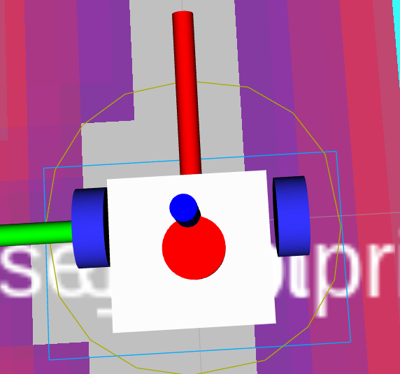
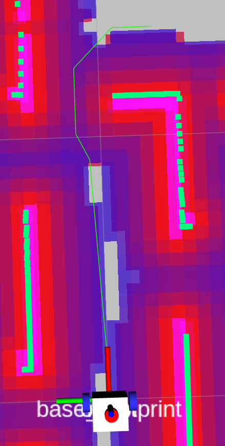

# 调参素材

机器人参数（底盘 124×202 mm，最高线速度 0.2 m/s，最高角速度0.6rad/s）

## slam_toolbox

## nav2

调参顺序：

1. Costmap（代价地图）
2. ​`global_costmap`（全局规划器）
3. local_costmap（局部规划器）
4. Recovery Behaviors（恢复行为树）

‍

### Costmap（代价地图）

**==原则：先把障碍物膨胀做对，后续所有规划/控制才有意义。==** 

```yaml
核心概念：
- 栅格地图：把空间分成一格格，每格有代价值 0-254
- 0   = 自由空间（可以走）
- 254 = 致命障碍（不能走）
- 中间值 = 膨胀区（尽量不走）

参数：
- robot_radius、footprint  → 决定膨胀起点
- inflation_radius         → 决定膨胀终点
- cost_scaling_factor      → 决定膨胀曲线陡峭程度
```

#### Footprint 验证（必调前置）

**参考：**​[设置机器人足迹 — Nav2 1.0.0 文档 --- Setting Up the Robot’s Footprint — Nav2 1.0.0 documentation](https://docs.nav2.org/setup_guides/footprint/setup_footprint.html)

实机 **footprint**（长 124 mm，宽 202 mm）：

```
[[0.035, 0.101], [0.035, -0.101], [-0.089, -0.101], [-0.089, 0.101]]
```

**参数解释：**   
左前角:   x= 0.035, y= 0.101  
右前角:   x= 0.035, y=-0.101  
右后角:   x=-0.089, y=-0.101  
左后角:   x=-0.089, y= 0.101  
总：  
车体宽度 = 0.101 - (-0.101) = 0.202 m  
车体长度 = 0.035 - (-0.089) = 0.124 m

**参数范围：**

​`global_costmap` 用 `robot_radius`  
我给的 12.5 换算直径 25，相当于5cm误差

local_costmap 用 `footprint`  
​`footprint: "[[0.05, 0.126], [0.05, -0.126], [-0.104, -0.126], [-0.104, 0.126]]"`  
前后各1.5cm 左右 各 2.5cm 误差  
总体：长 0.154m 宽 0.252m

**验收方式：** 在 RViz2 中订阅  
​`/local_costmap/published_footprint`  
​`/global_costmap/published_footprint`  
确认机器人轮廓。

​

---

#### inflation_radius — 膨胀半径

- 太小：沿墙贴边行走
- 太大：窄道无法通行，卡在门口

---

#### cost_scaling_factor — 膨胀梯度陡峭程度

- 太小（< 1.5）：绕远路
- 太大（> 5.0）：贴近障碍物

---

### global_costmap（全局规划器）

```yaml
全局规划：
  输入：当前位置 + 目标位置 + 全局地图
  输出：一条从起点到终点的路径（/plan）
  特点：慢（1Hz），看全局，不管动态障碍
  类比：出发前用高德地图规划路线
```

全局规划采用 `ThetaStar` 非 `SmacPlanner2D`、`NavFn`  
因：`SmacPlanner2D` 、`NavFn`不好调试 路径 距离 障碍物 的距离

#### `w_traversal_cost` — 避障权重

**越大越追求远离障碍**。

- 调大：路径**绕远点远离障碍，路径对 costmap 抖动更敏感**
- 调小：路径贴墙，路径更稳定

#### w_euc_cost — 路径长度权重

欧氏距离的权重。**越大越追求路径最短**。

- 调大：路径**最短**，可能贴近障碍

- 调小：不在意长度，可能会绕远点

**想让规划速度更快**

**首选**：`w_heuristic_cost` 调大（1.0 → 2.0），让搜索更贪心**次选**：global\_costmap `resolution` 调粗（0.05 → 0.1）

---

**全局规划器调参流程：**

1. 运行gazebo、slam、nav2
2. 调试全局规划器，生成的路径（该命令只看规划的路径，机器人不动）

    ```yaml
    # 发布一次
    ros2 action send_goal /compute_path_to_pose nav2_msgs/action/ComputePathToPose \
      "{goal: {header: {frame_id: 'map'}, pose: {position: {x: 1.4, y: -0.2, z: 0.0}, orientation: {w: 1.0}}}}"

    # 循环发布，每秒执行一次
    while true; do
      ros2 action send_goal /compute_path_to_pose nav2_msgs/action/ComputePathToPose \
        "{goal: {header: {frame_id: 'map'}, pose: {position: {x: 1.5, y: -0.8, z: 0.0}, orientation: {w: 1.0}}}}"
      sleep 1
    done
    ```

    rviz2 需订阅 `/plan` 即可看到全局规划器 规划出来的路径

    ​

    1. 调 `global_costmap`  
        ​`inflation_radius`、`cost_scaling_factor` 让路径远离障碍物

    2. 感觉离障碍有点距离，就调 `w_traversal_cost`​
    3. 当调的路径就只有太抖时调 `w_euc_cost`​

---

### local_costmap（局部规划器）

```yaml
局部控制：
  输入：全局路径 + 当前传感器数据（/scan）
  输出：实时速度命令（/cmd_vel）
  特点：快（20Hz），看局部，处理动态障碍
  类比：开车时实时躲避前方突然出现的行人
```

局步规划器采用 `Regulated Pure Pursuit (RPP)` 非  
​`DWB`、`MPPI`  
因：

**DWB**

1. DWB /local_plan 不跟着全局 /plan  
    全局规划的路径绕开了墙，DWB为了走最短路径帖着墙走。

2. 各种转角规划失败

---

**MPPI**

1. 用默认参数/调参后出现异常行为（如快到达目标点，剩余距离前进即可，会规划倒车入库），未能定位原因
2. 导航效果程怪怪的，给了个直线目标，全局规划了直线，mppi歪着走。
3. 从X：0，Y：0到X：1，Y：0.5 加了Y会出现，先走X然后卡死的情况

---

**RPP**

1. 追踪不错，稳稳的追随 全局路线
2. 导航窄通道(车宽 - 通道宽 = 20 内) 把 `use_collision_detection` 关闭，否则前馈认为撞到障碍物，会触发急停
3. ​`use_rotate_to_heading - 原地转向对齐路径` 开启  
    注：开启 `use_rotate_to_heading` 需关闭 `allow_reversing - 反向行驶`​
4. RPP 再窄通道路径下偏离 ThetaStar规划好的路径  
    注：ThetaStar规划的没有问题  
    调整：  

    ```yaml
    use_velocity_scaled_lookahead_dist: true
    lookahead_dist: 0.3            # 从 0.5 降到 0.3
    min_lookahead_dist: 0.2        # 从 0.3 降到 0.2
    max_lookahead_dist: 0.5        # 从 0.8 降到 0.5
    lookahead_time: 1.0            # 从 1.5 降到 1.0
    ```
5. 默认 BT 会以1s 的频率 更新全局规划路径，这会导致  
    规划出来的路径一直频繁变化  
    如：我再同个位置不动，路线可能一会左边，一会右边

    修改BT 用 `IsPathValid` 替代周期性重规划，只有路径被障碍挡住才重规划
6. 别配置 `Collision Monitor` ，会导致走窄通道触发急停

‍
